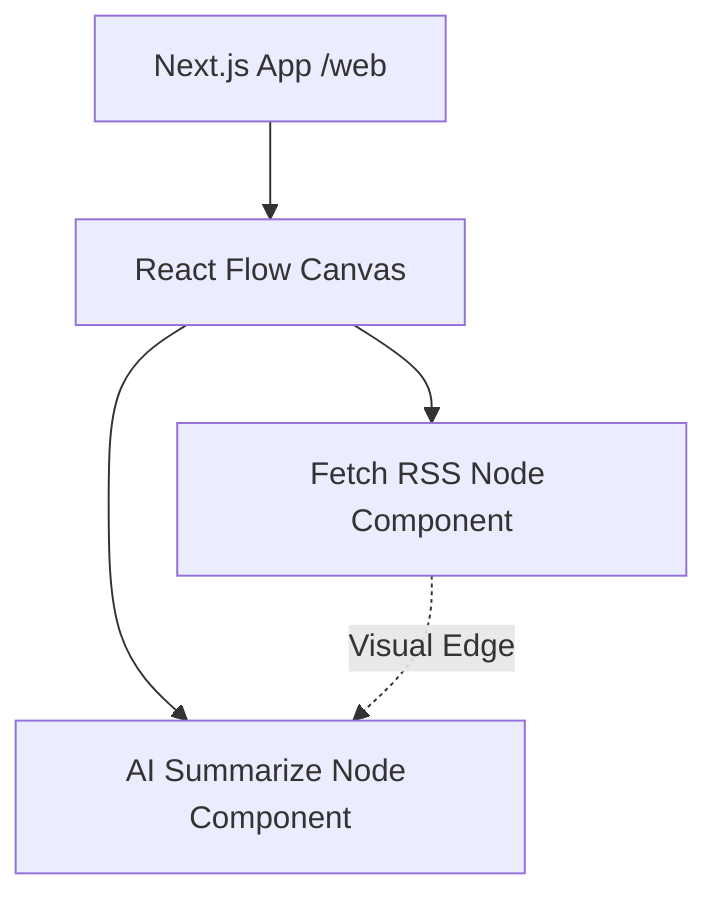

# Feature Specification Document: Visual AI Newsletter Pipeline Manager

## 1. Executive Summary

- **Feature**: Visual AI Newsletter Pipeline Manager (MVP)
- **Status**: Implemented
- **Summary**: A Next.js-based web application providing a visual, no-code, endless-canvas interface for managing the automated AI newsletter pipeline. It allows users to visually represent the steps of fetching news sources and summarizing them using AI, replacing command-line script execution with an intuitive drag-and-drop workflow builder.

## 2. Design Philosophy & Guiding Principles

**Clarity vs. Power:**
- **Our Principle**: Prioritize clarity above all. The node interface should immediately convey the step in the pipeline (e.g., "Fetch RSS", "AI Summarize") without overwhelming the user with complex configuration options in the MVP phase.

**Convention vs. Novelty:**
- **Our Principle**: Adhere strictly to platform conventions for node-based editors (similar to n8n or Google Opal). Users should intuitively know how to pan the canvas and connect nodes.

**Guidance vs. Freedom:**
- **Our Principle**: Provide a flexible "sandbox" to work in. The endless canvas allows users to arrange their pipeline steps as they see fit, though the flow of data is inherently guided by node connections.

**Aesthetic & Tone:**
- **Our Principle**: The tone is professional, clean, and modern, aligning with the "Stable Output" persona of the newsletter. We use semantic Tailwind v4 colors to support both light and dark modes seamlessly.

## 3. Problem Statement & Goals

- **Problem**: Managing the AI newsletter pipeline via raw Python/Node.js scripts is intimidating for non-technical users and lacks visibility into the overall workflow structure.
- **Goals**:
  - Goal 1: Provide a visual representation of the newsletter pipeline steps.
  - Goal 2: Establish a foundation for future drag-and-drop pipeline editing.
- **Success Metrics**:
  - Metric 1: The React Flow canvas renders successfully without errors.
  - Metric 2: Custom nodes for core actions (Fetch, Summarize) are correctly displayed and styled.

## 4. Scope

- **In Scope:**
  - Next.js App Router foundation.
  - Integration of `@xyflow/react` for the endless canvas.
  - Custom React Flow nodes: `FetchNode` and `AiSummarizeNode`.
  - Tailwind v4 theming integration for dark/light mode support.
  - Basic Jest testing for component rendering.
- **Out of Scope:**
  - Actual execution of the backend Python/Node.js fetching and summarization scripts via the UI.
  - Saving/loading canvas state to a database.
  - Dynamic node creation (dragging new nodes from a sidebar).

## 5. User Stories

- As a **Newsletter Editor**, I want **to see my pipeline steps visually represented as nodes** so that **I can easily understand the flow of data from raw RSS to AI summary.**
- As a **Developer**, I want **a robust, typed, and tested Next.js foundation** so that **I can safely iterate and add execution capabilities in the future.**

## 6. Acceptance Criteria

- **Scenario: Viewing the Pipeline Canvas**
  - **Given**: The user navigates to the root URL (`/`).
  - **When**: The page loads.
  - **Then**: An interactive endless canvas is displayed.
  - **And**: Two pre-connected nodes ("Fetch RSS" and "AI Summarize") are visible.
  - **And**: The UI respects the system's color scheme (dark/light mode).

## 7. UI/UX Flow & Requirements

- **User Flow**:
  1. User accesses the web application homepage.
  2. User views the `WorkflowCanvas` component containing the pre-configured pipeline nodes.
  3. User can pan and zoom the canvas to inspect the nodes.
- **Visual Design**: The UI features a clean, full-width canvas. Nodes are styled as rounded, shadowed cards with distinct icons (Lucide React) representing their function. Semantic Tailwind classes (`bg-background`, `border-border`) ensure consistent theming.
- **Copywriting**:
  - Page Title: "InnoSage AI Pipeline Manager"
  - Node Labels: "Fetch RSS" (Fetch from Sources), "AI Summarize" (Summarize with Stable Tone)

## 8. Technical Design & Implementation

- **High-Level Approach**: Bootstrap a Next.js (App Router) application. Use `@xyflow/react` to render the canvas. Define custom node components (`FetchNode`, `AiSummarizeNode`) that implement the `NodeProps` interface for type safety.
- **Component Breakdown**:
  - `src/app/page.tsx`: Main entry point, sets up the layout and renders the canvas container.
  - `src/components/workflow/WorkflowCanvas.tsx`: Initializes React Flow state and manages node/edge arrays.
  - `src/components/workflow/FetchNode.tsx`: Custom node UI for RSS fetching.
  - `src/components/workflow/AiSummarizeNode.tsx`: Custom node UI for AI summarization.
- **Key Logic**: The canvas utilizes a flex-grow layout to responsively fill the viewport minus header space, eliminating brittle hardcoded heights.

## 9. Data Management & Schema

### 9.1. Data Source
In the MVP, data is statically defined within the `WorkflowCanvas.tsx` component state (`initialNodes`, `initialEdges`).

### 9.2. Data Schema
React Flow standard node schema, customized with specific data payloads:
```json
{
  "id": "1",
  "type": "fetchRss",
  "position": { "x": 100, "y": 100 },
  "data": { "label": "Fetch from Sources" }
}
```

### 9.3. Persistence
In-memory state only for the MVP. No persistent storage is currently implemented.

## 10. Storage Compatibility Strategy (Critical)

| Feature Aspect | Firebase (Cloud) | Google Drive (BYOS) | Static Mirror (R2) |
| :--- | :--- | :--- | :--- |
| **Data Storage** | N/A (MVP is stateless) | N/A | N/A |
| **Pipeline State**| Hardcoded in UI state | Hardcoded in UI state | Hardcoded in UI state |

## 11. Environment & Runtime Compatibility

| Feature Aspect | Local Dev (localhost) | Production (Deployed) |
| :--- | :--- | :--- |
| **Availability** | Full | Full |
| **Behavior** | Standard Next.js dev server execution | Static/Server-rendered Next.js build |

## 12. Manual Verification Script (QA)

### 12.1. Executable Validation Script
```javascript
(async () => {
  console.group('🧪 Feature Verification: Workflow Canvas');
  try {
     // Verify main heading exists
     const heading = document.querySelector('h1');
     if (!heading || !heading.textContent.includes('InnoSage AI Pipeline Manager')) {
         throw new Error('Main heading not found or incorrect text.');
     }

     // Verify React Flow container exists
     const reactFlowContainer = document.querySelector('.react-flow');
     if (!reactFlowContainer) {
         throw new Error('React Flow canvas did not render.');
     }

     // Verify custom nodes exist in the DOM
     const fetchNodeText = document.evaluate("//div[contains(., 'Fetch RSS')]", document, null, XPathResult.FIRST_ORDERED_NODE_TYPE, null).singleNodeValue;
     const aiSummarizeText = document.evaluate("//div[contains(., 'AI Summarize')]", document, null, XPathResult.FIRST_ORDERED_NODE_TYPE, null).singleNodeValue;

     if (!fetchNodeText || !aiSummarizeText) {
         throw new Error('Custom nodes are missing from the canvas.');
     }

     console.log('✅ SUCCESS: Canvas and nodes rendered correctly.');
  } catch (e) {
     console.error('❌ FAILED', e);
  }
  console.groupEnd();
})();
```

### 12.2. Happy Path (Core Workflow)
1. **Step**: Navigate to `http://localhost:3000` (after running `npm run dev`).
   - **Expected**: The Next.js app loads showing the "InnoSage AI Pipeline Manager" header.
2. **Step**: Observe the canvas area below the header.
   - **Expected**: The canvas fills the remaining screen space. Two nodes ("Fetch RSS" and "AI Summarize") are visible and connected by an edge.
3. **Step**: Click and drag a node.
   - **Expected**: The node moves smoothly across the endless canvas grid.

## 13. Limitations & Known Issues

- **Limitation 1**: The current implementation is purely visual. The nodes do not execute any backend logic yet.
- **Limitation 2**: Node configuration is hardcoded. Users cannot currently add new nodes or edit existing node configurations via the UI.

## 14. Architectural Visuals (Optional)

### After: Visual Pipeline Architecture (MVP)



## 15. Setup & Configuration Guide (Optional)

### Step 1: Install Dependencies
1. Navigate to the `/web` directory: `cd web`
2. Run `npm install` to install Next.js, React Flow, and other requirements.

### Step 2: Run Development Server
1. Ensure you are in the `/web` directory.
2. Run `npm run dev` to start the local development server on port 3000.
3. Open a browser and navigate to `http://localhost:3000`.