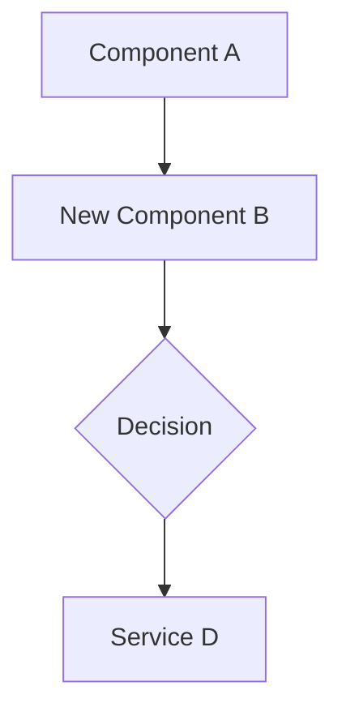

### **FFD Master Template V3**

**Instructions:** Choose the profile that best fits the "center of gravity" of your task's complexity. Delete this guide and all sections marked as "Not Applicable" for your chosen profile.

**1. Discovery Profile (FFD-Lite)**

- **Use Case:** For validating new, unproven ideas. Goal is to clarify the problem before committing to a full build.
- **Sections to Keep:**
  - `1. Executive Summary` (as a one-sentence hypothesis)
  - `5. Problem Statement, Goals, & Success Metrics`
  - `6. Scope`
  - `12. Limitations & Open Questions`

**2. Full Feature Profile (Default)**

- **Use Case:** For new, user-facing features where the primary complexity is in the product requirements, user journey, and UI/UX design.
- **Sections to Keep:** All sections.

**3. UI/UX Polish Profile**

- **Use Case:** For minor UI changes, UX improvements, or visual bug fixes that have minimal architectural impact.
- **Sections to Keep:**
  - `1. Executive Summary`
  - `4. Design Philosophy & Guiding Principles`
  - `7. User Stories & Acceptance Criteria`
  - `8. User Journey & UI/UX`
  - `10. Implementation Plan / Task Breakdown` (may be simplified)
  - `16. AI Design & UX Brief`
  - `18. Execution & Review Log`

**4. Technical Task Profile**

- **Use Case:** For backend refactors, API changes, or build script changes with **no direct UI impact**.
- **Sections to Keep:**
  - `1. Executive Summary`
  - `3. Document Status & Completion Checklist`
  - `5. Problem Statement, Goals, & Success Metrics`
  - `9. Proposed Architecture & Data Models`
  - `10. Implementation Plan / Task Breakdown`
  - `11. Technical Edge Cases & Error Handling`
  - `12. Limitations & Open Questions`
  - `13. AI Red Team Challenge`
  - `14. Setup & Configuration Guide`
  - `15. AI Engineering Brief`
  - `18. Execution & Review Log`

**5. Epic / Initiative Profile**

- **Use Case:** For tracking a large initiative or a collection of related FFDs.
- **Sections to Keep:**
  - `1. Executive Summary`
  - `2. Phased Roadmap / Initiative Breakdown`
  - `6. Scope` (can be used for Epic-level scope)

**6. Architectural Enhancement Profile (NEW)**

- **Use Case:** For tasks involving significant backend or architectural changes that result in a specific, user-facing UI/UX improvement (e.g., performance tuning, data resilience for UI state, or a complex refactor to enable a simple UI feature).
- **Guidance:** All sections are available. Primary sections for this profile are listed below. Other sections (like `Design Philosophy`) can be kept for nuance or deleted.
- **Primary Sections to Keep:**
  - `1. Executive Summary`
  - `3. Document Status & Completion Checklist`
  - `5. Problem Statement, Goals, & Success Metrics`
  - `6. Scope`
  - `7. User Stories & Acceptance Criteria`
  - `8. User Journey & UI/UX` (can be simplified to "Visual Specification")
  - `9. Proposed Architecture & Data Models`
  - `10. Implementation Plan / Task Breakdown`
  - `11. Technical Edge Cases & Error Handling`
  - `12. Limitations & Open Questions`
  - `13. AI Red Team Challenge`
  - `15. AI Engineering Brief`
  - `18. Execution & Review Log`

---

# FFD: [Feature Name]

**Status:** `Idea` | `Planned` | `In Design` | `In Progress` | `Implemented`
**Author:** Architect
**Date:** YYYY-MM-DD
**Reviewers:** `AI-CTO`, `AI-Product-Lead`

---

## 1. Executive Summary

[A brief, one-paragraph summary of the feature. What is it, and what is its primary purpose? This should be understandable by both technical and non-technical stakeholders.]

## 2. Phased Roadmap / Initiative Breakdown

_[Use this section for the 'Epic' profile. It serves as the master plan for a large initiative.]_

---

### **Phase 1: [Name of the First Phase]**

- **Status:** `Planned`
- **Summary:** [A one-sentence summary of this phase.]
- **FFD Link:** [Link to the detailed FFD for this phase]

---

### **Phase 2: [Name of the Second Phase]**

- **Status:** `Planned`
- **Summary:** [A one-sentence summary of this phase.]
- **FFD Link:** [Link to the detailed FFD for this phase]

---

## 3. Document Status & Completion Checklist

_[Use this optional section when the Status is 'Planned' or 'In Design'. Delete if not needed.]_

**Current Status:** `[e.g., In Design]`

This document is considered complete and ready for implementation when all of the following steps have been checked off.

- [ ] Problem statement and goals defined.
- [ ] Scope (In/Out) finalized.
- [ ] Key user stories and acceptance criteria written.
- [ ] High-level architecture proposed and agreed upon.
- [ ] Data models defined and reviewed.
- [ ] Final review and sign-off from all stakeholders.

## 4. Design Philosophy & Guiding Principles

[This section defines the core user experience principles for this feature. It serves as a compass for all subsequent design and implementation decisions.]

**Clarity vs. Power:**

- **Guiding Question**: Is the primary goal for this feature to be immediately understandable and simple, or to be feature-rich and powerful for expert users?
- **Our Principle**: [e.g., "Prioritize clarity above all. A new user should understand it in 5 seconds."]

**Convention vs. Novelty:**

- **Guiding Question**: Should this feature leverage familiar, industry-standard patterns, or should we introduce a novel interaction?
- **Our Principle**: [e.g., "Adhere strictly to platform conventions. It should feel like a native, predictable part of the system."]

**Guidance vs. Freedom:**

- **Guiding Question**: Should we provide a highly opinionated, step-by-step workflow, or give users a flexible "sandbox" to work in?
- **Our Principle**: [e.g., "Provide strong guardrails and a clear 'happy path.'"]

**Aesthetic & Tone:**

- **Guiding Question**: What is the emotional goal of this feature? What should the user feel?
- **Our Principle**: [e.g., "The tone is professional, minimalist, and fast. Animations will be subtle and purposeful."]

## 5. Problem Statement, Goals, & Success Metrics

- **Problem**: [Describe the user pain point or business problem this feature is intended to solve. Why is this feature necessary?]
- **Goals**: [List the primary, specific, and measurable objectives of the feature.]
  - Goal 1: ...
  - Goal 2: ...
- **Success Metrics**: [How will we know if the feature is successful? List quantifiable metrics.]
  - Metric 1: [e.g., Reduce time to complete a task by X%.]
  - Metric 2: [e.g., Increase feature adoption by Y% in the first month.]

## 6. Scope

- **In Scope (V1):** [Clearly list everything that is included in the first version of this feature. Be specific.]
  - ...
  - ...
- **Out of Scope (V1):** [Explicitly list what is **not** included. This is crucial for preventing scope creep.]
  - ...
  - ...

## 7. User Stories & Acceptance Criteria

### User Stories

[Describe the feature from the user's perspective.]

- As a **[User Type/Role]**, I want **[to perform an action]** so that **[I can achieve a benefit]**.
- As a **...**, I want **...** so that **...**.

### Acceptance Criteria

[Define the specific, testable conditions that must be met for the feature to be considered complete using Gherkin syntax.]

- **Scenario: [A clear description of the happy path scenario]**
  - **Given**: [The initial state or precondition]
  - **When**: [The action performed by the user]
  - **Then**: [The expected outcome or result]

- **Scenario: [A clear description of an edge case or error scenario]**
  - **Given**: ...
  - **When**: ...
  - **Then**: ...

### Manual Test Cases

[This section provides a concrete, step-by-step script for human verification of the feature's core functionality.]

---

**Test Case ID:** `TC-01`
**Title:** `[Example: Happy Path for Feature X]`
**Associated User Story:** `[Example: As a user, I want...]`

**Preconditions:**

- [e.g., The user is logged in.]
- [e.g., The app is in a specific state.]

**Steps:**

1.  [First action the user takes. e.g., "Navigate to the Settings screen."]
2.  [Second action. e.g., "Tap on the 'Profile' button."]
3.  [Continue with all required steps.]

**Expected Result:**

- [A specific, observable outcome. e.g., "The Profile screen opens."]
- [Another specific, observable outcome. e.g., "The user's email address is correctly displayed."]

---

## 8. User Journey & UI/UX

- **User Flow**: [Describe the step-by-step journey the user takes.]
  1.  User starts at [Screen A].
  2.  User interacts with [UI Element B].
  3.  ...
- **Visual Design**: [Link to mockups, wireframes, or prototypes in Figma, Sketch, etc.]
- **Copywriting**: [List any new user-facing text, such as button labels, titles, or error messages.]

---

## 9. Proposed Architecture & Data Models

[This section outlines the detailed engineering plan.]

### High-Level Approach

[Describe the overall technical strategy. Will new components/classes be created? Will existing ones be modified? Are there any new libraries involved?]

### Architectural Decisions & Alternatives Considered

[This section explicitly records key architectural decisions and briefly explains the reasoning, including why alternative approaches were rejected. It functions as a lightweight Architecture Decision Record (ADR).]

- **Decision:** [A clear, one-sentence summary of the chosen path. e.g., "We will use a background service to handle data synchronization."]
- **Reasoning:** [Why this path was chosen. Focus on benefits like scalability, maintainability, performance, etc. e.g., "This decouples the sync logic from the UI lifecycle, ensuring robustness during app backgrounding."]
- **Alternative Rejected:** [Name the alternative approach that was considered. e.g., "Performing data sync directly within the ViewModel."]
- **Reason for Rejection:** [Explain the critical flaw or trade-off that made the alternative unsuitable. e.g., "This would lead to complex lifecycle management and potential cancellation of critical network operations if the user navigates away."]

### Component Interaction Diagram

[Use Mermaid syntax to visualize the data flow and component relationships.]



### Component Responsibilities

- **`NewComponent.kt`:** [Describe its role, state, and key responsibilities.]
- **`ModifiedViewModel.kt`:** [Describe the changes and new responsibilities.]
- **`ExistingService.kt`:** [Describe its role in this feature.]

### Data Models

[Define any new or modified data structures using code blocks.]

```kotlin
// Location: path/to/DataModel.kt
data class NewDataModel(
    val id: String,
    // ...
)
```

## 10. Implementation Plan / Task Breakdown

[Break down the engineering work into a sequence of actionable steps.]

1.  **[Data Model]** Implement the data models.
2.  **[Domain]** Create the new service/manager class.
3.  **[DI]** Register the new components in Koin.
4.  **[ViewModel]** Modify the ViewModel to integrate the new logic.
5.  **[UI]** Build the UI components.
6.  **[Testing]** Write unit/integration tests for the new logic.

## 11. Technical Edge Cases & Error Handling

[List potential technical failure modes and the plan to handle them.]

- **Scenario:** [e.g., Network request fails mid-operation.]
  - **Handling:** [e.g., The system will show a specific error message and offer a retry button.]
- **Scenario:** [e.g., Invalid data is received from the API.]
  - **Handling:** [e.g., The data will be ignored, and a non-fatal error will be logged.]
- **Scenario:** [e.g., A required hardware permission is denied.]
  - **Handling:** [e.g., A dialog will be shown guiding the user to system settings.]

## 12. Limitations & Open Questions

- **Limitations:** [Be transparent about any known constraints or trade-offs.]
- **Open Questions:** [List any unresolved technical questions that need to be answered during implementation.]
  - Question 1: ...
  - Question 2: ...

## 13. AI Red Team Challenge

_[This section is for strategic review. Brief an AI Agent with your Product Lead persona to challenge this feature before committing to development.]_

**Prompt for AI Product Lead:**
"Review this FFD. Your goal is to act as a Socratic challenger and de-risk our decision.

1.  What is the strongest argument _against_ building this feature right now?
2.  What is the single riskiest assumption we are making?
3.  What is a simpler, faster, or cheaper way to solve the core user problem that we haven't considered?"

**AI Response & Founder's Decision:**

- **AI Challenge:** [Paste the AI's response here.]
- **Founder's Decision:** [e.g., "The AI correctly identified that we are assuming users understand concept X. We will add a tooltip to mitigate this. Proceeding with the plan."]

## 14. Setup & Configuration Guide

_[Use this optional section if the feature requires manual setup by a developer (e.g., adding API keys to environment variables, configuring a third-party service).]_

### Step 1: [Name of the first major step]

1.  [First action item]
2.  [Second action item]

---

---

## AI Agent Briefs & Execution Log

_[Use these optional sections to brief your specialized AI agents and to log the execution and review of their work. This is your mission control center.]_

## 15. AI Engineering Brief

- **Context Map (File Paths):** [List all relevant files the AI must read and understand before starting work.]
  - `path/to/relevant/File1.kt`
  - `path/to/relevant/File2.kt`
- **System Prompt Snippet:** [Specific rules or persona adjustments for this task.]
  - _e.g., "For this task, prioritize immutability. All state changes in ViewModels must use the `copy()` method."_
- **Key Logic / Pseudocode:** [A high-level sketch of the core algorithm or logic you want the AI to implement.]
  - _e.g., "The core logic should use a `when` statement to handle the different sealed class states..."_
- **Testing Vectors:** [A checklist of specific scenarios the AI must generate unit tests for.]
  - `[ ]` Test case: Happy path with valid input.
  - `[ ]` Test case: Input is null or empty.
  - `[ ]` Test case: Network error occurs.

## 16. AI Design & UX Brief

- **Target User Persona:** [A brief description of the user this is for.]
  - _e.g., "This is for a non-technical user who values simplicity and a clean interface."_
- **Emotional Goal:** [Connects to the "Aesthetic & Tone" principle.]
  - _e.g., "The user should feel empowered and confident. The UI should be reassuring."_
- **Key Information to Display:** [The essential data points that must be visible.]
  - ...
- **Core Actions to Enable:** [List the user interactions needed.]
  - ...

## 17. AI Marketing & Go-to-Market Brief

- **Primary User Benefit:** [The core value proposition in a single sentence.]
  - _e.g., "Save time by automating your workflow."_
- **Target Audience Segment:** [Who are we speaking to?]
  - _e.g., "Busy professionals in creative industries."_
- **Keywords:** [Terms for SEO and App Store Optimization.]
  - ...
- **Drafting Tasks:** [Specific content creation requests.]
  - `[ ]` Draft a tweet announcing this feature.
  - `[ ]` Write a "What's New" paragraph for the App Store.

## 18. Execution & Review Log

[This section transforms the FFD from a plan into a living record of execution. You, the founder, fill this out as you work with your AI team.]

- **Log Entry 1:**
  - **Date:** YYYY-MM-DD
  - **AI Agent:** AI-CTO
  - **Task:** Decompose the FFD into a phased execution plan.
  - **Result Artifact (Link):** [**Link to Live Decomposition Document**]
  - **Founder's Review & Decision:** [e.g., "Phased plan approved. Proceeding with Phase 1."] **Status:** `Approved`

- **Log Entry 2:**
  - **Date:** ...
  - **AI Agent:** ...
  - **Task:** ...
  - **Result Artifact (Link):** ...
  - **Founder's Review & Decision:** ... **Status:** ...
